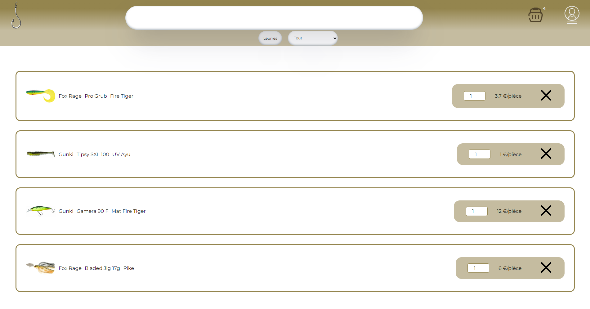

# L'ardillon-shop

## Fr

### Description

Site e-commerce de matériel de pêche.

### Détails

C'est un site e-commerce qui propose du matériel de pêche. J'ai réalisé le site entièrement, le front est fait en **react** et le back avec **node** herbergé sur vercel.
Il reste encore beaucoup de chose à améliorer sur ce projet que ce soit sur l'esthétisme ou les fonctionnalités, amélioration que j'apporterai dans le futur.

Je vous laisse le découvrir [ici](https://seblau02.github.io/l-ardillon-shop/)

## En

Hi, this is l'ardillon-shop, it's a fishing tool shop. I made all the app, the front is made using **react** and the back with **node** hosted on vercel.
It is not perfect but I will upgrade it in the futur.

You can visit it [here](https://seblau02.github.io/l-ardillon-shop/)

### Technologies: React.Js, Node.Js

### Images

